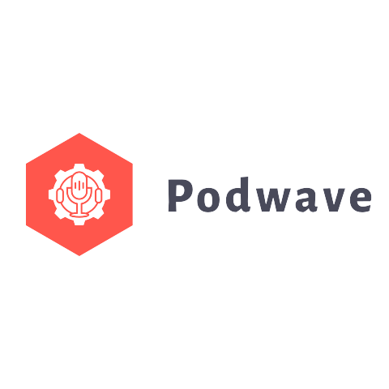

# The Podcast Psycholoog's Podwave

## Inhoudsopgave
  * [Beschrijving](#beschrijving)
  * [Opdrachtgever](#opdrachtgever)
  * [Design challenge](#design-challenge)
  * [Data](#data)
  * [Planning](#planning)
  * [Licentie](#licentie)

## Beschrijving
Podwave is een project dat voortbouwt op de functionaliteiten van OpenAI Whisper voor *speech-to-text*. Het bestaat uit twee interfaces: één waar een podcast-eigenaar het ruwe json-bestand, gemaakt door Whisper, kan bewerken, en één waar een (betalende) gebruiker een podcast kan afspelen terwijl hij door een website scrolt met de (live rollende) transcriptie.

## Opdrachtgever
De opdrachtgever voor dit project is de Podcast Psycholoog, vertegendwoordigt door Leonie van Dijk. Zij zien de waarde in van toegankelijkheid en willen hun inhoud gemakkelijker maken voor hun luisteraars om te volgen en te begrijpen.

## Design challenge
De uitdaging voor het ontwerp is het creëren van een intuïtieve en gebruiksvriendelijke interface voor zowel de podcast-eigenaar als de luisteraar.

### User stories
1) Als podcast-eigenaar, wil ik de ruwe transcriptie kunnen bewerken, zodat ik ervoor kan zorgen dat deze nauwkeurig is.

2) Als betalende gebruiker, wil ik een podcast kunnen afspelen en door de transcriptie kunnen scrollen, zodat ik de inhoud gemakkelijker kan volgen.

3) Als betalende gebruiker, wil ik de live rollende transcriptie kunnen zien, zodat ik de podcast kan volgen op mijn eigen tempo.

## Data
De data die gebruikt worden in dit project komen van de ruwe `JSON`-bestanden die door OpenAI Whisper's spraak-naar-tekst functionaliteit worden gecreëerd.

## Planning
In de eerste week van de meesterproef is een briefing met de opdrachtgever en begeleiders. Wekelijks wordt aan de opdrachtgever een prototype gedemonstreerd en de volgende stappen besproken. Tussentijds kunnen via Teams vragen gesteld worden.

## Licentie
Dit project valt onder de voorwaarden van de [MIT-licentie](./LICENSE).
